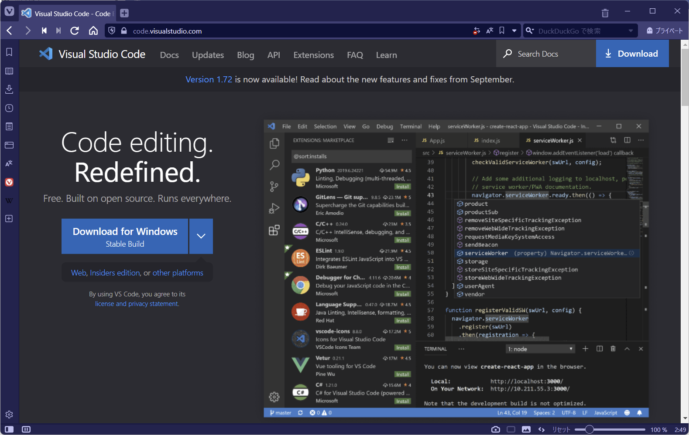
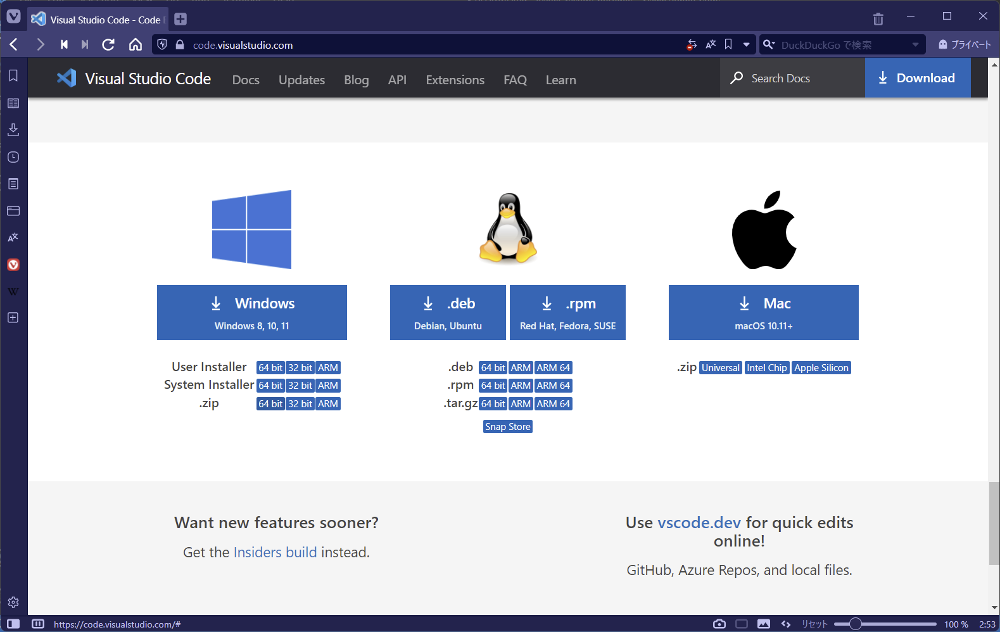

## VSCode インストール（）

ダウンロードページ:  
https://code.visualstudio.com/

ダウンロードページ下部にある、Windows .zip 64bit をダウンロードする。

ダウンロードした Zip ファイルを任意の場所に解凍する。

Zip 解凍先の例:  
C:\VSCode

### data フォルダの作成

解凍したフォルダの中に data フォルダを作成する。

data フォルダを作成して VSCode を起動すると、
data フォルダの中に extensions フォルダと user-data フォルダが作成される。

この中にインストールした拡張機能やユーザ設定が保存される。

### ポータブル版の使い道

ポータブル版を使うことで、PC 内に設定の違う VSCode を複数揃えることができる。

また、data フォルダをチームで共有することで、
VSCode の設定をチームメンバで揃えることができる。
